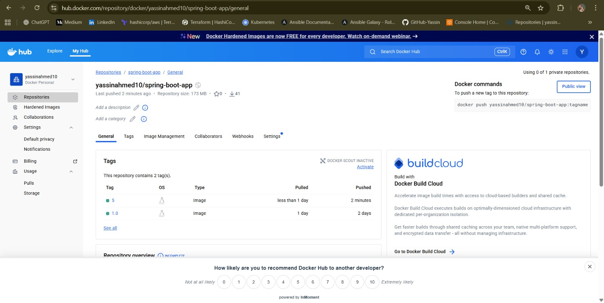
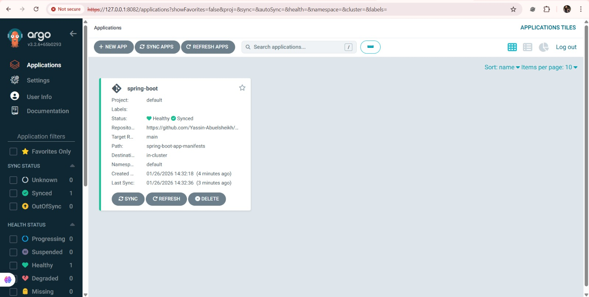

# 🚀 Jenkins Full DevOps CI/CD & GitOps Project

This repository demonstrates a **complete end-to-end DevOps workflow** for a **Spring Boot application**, starting from CI/CD automation, passing through **SonarQube Quality Gates**, artifact management, containerization, and ending with **GitOps-based deployment using Argo CD on Kubernetes**.

---

## 🧩 CI/CD High-Level Architecture

![CI/CD Diagram]

**Description:**  
This diagram illustrates the complete CI/CD architecture used in this project.  
A code push to GitHub triggers Jenkins, which runs build, test, and quality analysis stages.  
Artifacts are published to Nexus, Docker images are pushed to Docker Hub, and deployment is handled using GitOps with Argo CD.

## 📧 Failure Notification – Email Alert

**Description:**  
When the Quality Gate fails, Jenkins automatically sends an **email notification** containing:
- Job name
- Build number
- Failure status
- Direct link to the Jenkins build  

This ensures fast feedback and quick issue resolution.

---

## ✅ SonarQube Quality Gate – PASSED

![SonarQube Passed]

**Description:**  
After fixing the detected issues and improving code quality, the SonarQube analysis passes successfully.  
Once the **Quality Gate is green**, the pipeline is allowed to continue to the next stages.

---

## 🗄️ Artifact Published to Nexus Repository

**Description:**  
This image confirms that the Spring Boot Maven artifact has been successfully published to **Nexus Repository**.

Nexus is used for:
- Centralized artifact storage
- Versioning and traceability
- Reliable rollback capability

---

## 📦 Docker Image Pushed to Docker Hub

**Description:**  
After publishing the artifact, Jenkins builds a Docker image and pushes it to **Docker Hub**.  
Each image is tagged using the Jenkins build number to ensure:
- Clear versioning
- Full traceability
- Easy rollback

---

## ✅ Jenkins Pipeline – Full Successful Execution

![Jenkins Pipeline Success]

**Description:**
This image shows the **final successful execution of the Jenkins CI/CD pipeline** after all stages have passed successfully.

The pipeline includes:
- Checkout source code from GitHub
- Build & unit tests using Maven
- SonarQube static code analysis
- Quality Gate validation (PASSED)
- Publishing the artifact to Nexus Repository
- Building the Docker image
- Pushing the Docker image to Docker Hub
- Post-build actions and notifications

---

## 🚀 GitOps Workflow with Argo CD

**Description:**  
This diagram demonstrates the **GitOps deployment model**:
- Git is the single source of truth
- Kubernetes manifests are stored in Git
- Argo CD continuously monitors the repository
- Any change is automatically synchronized to the cluster  

No manual deployment commands are required.

All stages are marked in green, confirming that the application is **ready for deployment** and can safely move to the **continuous delivery phase using GitOps (Argo CD)**.
## 📊 Argo CD Application – Live Kubernetes State

---

**Description:**  
This view shows the Argo CD application tree displaying live Kubernetes resources:
- Deployment
- ReplicaSet
- Pods
- Service  

The application is **Healthy** and **Synced**, confirming a successful GitOps deployment.

---

## 🛠️ Tools & Technologies
- **Language:** Java (Spring Boot)
- **CI/CD:** Jenkins
- **Build Tool:** Maven
- **Code Quality:** SonarQube + JaCoCo
- **Artifact Repository:** Nexus Repository
- **Containerization:** Docker
- **Container Registry:** Docker Hub
- **CD / GitOps:** Argo CD
- **Orchestration:** Kubernetes

---

## ✅ Key DevOps Concepts Demonstrated
- End-to-End CI/CD Automation
- SonarQube Quality Gates Enforcement
- Shift-Left Testing
- Artifact Management with Nexus
- Docker Image Lifecycle
- GitOps-Based Continuous Delivery
- Kubernetes Deployment Automation

---

## 📌 Conclusion
This project represents a **real-world DevOps pipeline** that closely mirrors production environments.  
It demonstrates how CI, code quality enforcement, artifact management, containerization, and GitOps can be integrated into a single automated workflow.

⭐ Feel free to star the repository and extend it with monitoring, logging, or security scanning.

